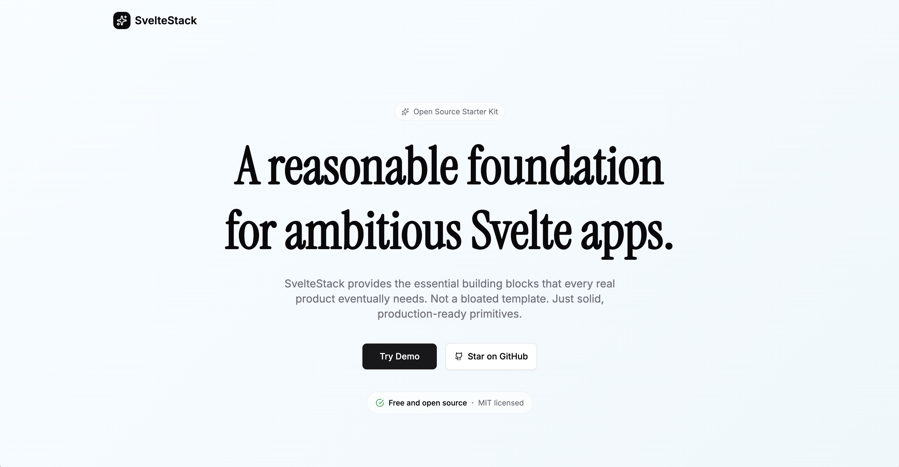

# SvelteStack

<div align="center">

[](https://github.com/vsamarth/sveltestack/actions/workflows/ci.yml)
[](https://codecov.io/gh/vsamarth/sveltestack)

**A reasonable foundation for ambitious Svelte apps.**

Production-ready building blocks for authentication, workspaces, members, roles, activity logs, and more.

</div>

<div align="center">
  
</div>

---

## ✨ Overview

SvelteStack is an open-source, production-ready starter kit for building modern full-stack applications with **SvelteKit** and **Svelte 5**. It provides the essential building blocks that every real product eventually needs—not a bloated template, just solid, production-ready primitives.

### What's Included

SvelteStack comes with **Vault**, a fully-functional demo application showcasing file storage and workspace management. Use it as a starting point for your own application, extend it with new features, or study it as a learning resource.

## 🚀 Features

### Core Building Blocks

- 🔐 **Authentication** - Secure email/password auth with [better-auth](https://www.better-auth.com/), Argon2 password hashing, and session management
- 🗄️ **Database Integration** - PostgreSQL with [Drizzle ORM](https://orm.drizzle.team/), type-safe queries, migrations, and seeding
- 👥 **Workspaces & Organizations** - Create, organize, and manage workspaces with multi-tenant isolation
- 📧 **Members & Invites** - Email-based team invitations with member management and role-based access
- 📝 **Activity Logs** - Comprehensive activity tracking and monitoring
- 📨 **Transactional Emails** - Email verification, password resets, and workspace invites with [Resend](https://resend.com/)
- ☁️ **File Storage** - S3-compatible storage with presigned URLs and [Uppy](https://uppy.io/) integration
- 🎨 **Modern UI Kit** - Pre-configured [Tailwind CSS](https://tailwindcss.com/) with [shadcn-svelte](https://www.shadcn-svelte.com/) components
- ✅ **Testing Setup** - Comprehensive test coverage with [Vitest](https://vitest.dev/) and [Playwright](https://playwright.dev/)

### Vault Demo Features

The included **Vault** application demonstrates:

- **File Management**
  - Drag-and-drop file uploads
  - Direct S3 upload with presigned URLs
  - Progress tracking and error handling
  - File previews and metadata
  - Workspace-aware file organization

- **Workspace Management**
  - Create and organize multiple workspaces
  - Rename and manage workspace settings
  - Multi-tenant workspace isolation
  - Access control and permissions

- **Team Collaboration**
  - Invite team members via email
  - Manage workspace members
  - Cancel pending invitations
  - Member removal capabilities

## 🛠️ Tech Stack

- **[SvelteKit](https://kit.svelte.dev/)** - Full-stack framework with Svelte 5
- **[Drizzle ORM](https://orm.drizzle.team/)** - Type-safe SQL queries
- **[PostgreSQL](https://www.postgresql.org/)** - Robust relational database
- **[better-auth](https://www.better-auth.com/)** - Modern authentication library
- **[Resend](https://resend.com/)** - Transactional email service
- **[Tailwind CSS](https://tailwindcss.com/)** - Utility-first CSS framework
- **[shadcn-svelte](https://www.shadcn-svelte.com/)** - Beautiful UI components
- **[Vitest](https://vitest.dev/)** - Fast unit testing framework
- **[Playwright](https://playwright.dev/)** - End-to-end testing

## 📋 Prerequisites

Before you begin, ensure you have the following installed:

- **[Bun](https://bun.sh/)** >= 1.0 (recommended package manager)
- **Node.js** >= 20 (required for some tooling)
- **[Docker](https://www.docker.com/)** with Docker Compose (for local database)

## 🏁 Getting Started

### Quick Start

1. **Clone the repository**

   ```bash
   git clone https://github.com/vsamarth/sveltestack.git
   cd sveltestack
   ```

2. **Run the setup script**

   ```bash
   bash scripts/setup.sh
   ```

   The setup script will:
   - ✅ Check all prerequisites (Node.js, Bun, Docker)
   - 📦 Install dependencies
   - 🔐 Create `.env` file with generated secrets
   - 🗄️ Start the PostgreSQL database
   - 🔄 Run database migrations
   - 🌱 Optionally seed sample data

3. **Start the development server**

   ```bash
   bun dev
   ```

4. **Open your browser**

   Visit [http://localhost:5173](http://localhost:5173) to see your app.

## 🏗️ Building Your Own App

Here are the key areas you can customize:

- **Branding** - Replace Vault branding with your own in `src/lib/config.ts`
- **Database Schemas** - Modify schemas in `src/lib/server/db/schema/`
- **UI Components** - Update components in `src/lib/components/`
- **API Routes** - Add your own routes in `src/routes/`
- **Email Templates** - Customize emails in `src/lib/emails/`

## 🧪 Testing

We want to ensure the foundations you build upon are always working. That's why SvelteStack ships with comprehensive integration and end-to-end tests. You can run them with:

```bash
# Run all tests
bun run test

# Run unit tests only
bun run test:unit

# Run E2E tests only
bun run test:e2e

# Run tests with coverage
bun run test:coverage

# Watch mode
bun run test:watch
```

## Deployment

We recommend deploying to [Vercel](https://vercel.com/) for hosting and [Neon](https://neon.tech/) for PostgreSQL. [Cloudflare R2](https://www.cloudflare.com/products/r2/) provides free S3-compatible storage for your file uploads.

More detailed instructions on how to set everything up are coming soon.

## 🤝 Contributing

Contributions are welcome! Please feel free to submit a Pull Request.

1. Fork the repository
2. Create your feature branch (`git checkout -b feature/amazing-feature`)
3. Commit your changes (`git commit -m 'Add some amazing feature'`)
4. Push to the branch (`git push origin feature/amazing-feature`)
5. Open a Pull Request

## 📄 License

This project is licensed under the MIT License - see the [LICENSE](LICENSE) file for details.

## 🙏 Acknowledgments

SvelteStack is built with amazing open-source tools:

- [SvelteKit](https://kit.svelte.dev/) - The web framework
- [shadcn-svelte](https://www.shadcn-svelte.com/) - Beautiful UI components
- [better-auth](https://www.better-auth.com/) - Authentication library
- [Drizzle ORM](https://orm.drizzle.team/) - Type-safe ORM
- [Resend](https://resend.com/) - Email service
- [Uppy](https://uppy.io/) - File upload library
- [Vitest](https://vitest.dev/) - Testing framework
- [Playwright](https://playwright.dev/) - E2E testing
